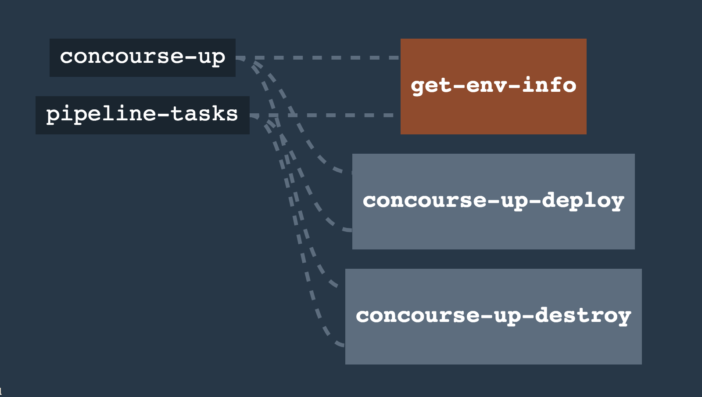

# concourse-up-up

A concourse-based encapsulation of [concourse-up](https://github.com/EngineerBetter/concourse-up) to run [concourse-up](https://github.com/EngineerBetter/concourse-up)... on concourse. Do you actually need this? Probably not. But it's a nice quick way to get a `ci.<some-org>.<tld>` up and running really quick.

## docker-quickstart

I personally like to run concourse on my local machine using the `docker-compose` concourse quickstart. You can `fly` up this pipeline on a local instance, which can be used to create (or destroy) a concourse instance on AWS.

## usage

The only problem you might have is with the `domain: "blahblah.net"` param. If you're running the pipeline for the first time in a newly created environment, you might need to create it _without_ specifying a domain (e.g., `domain: ""`) the first time you run `concourse-up-deploy`. Once it's created, you can fill out the domain param again, run it, and everything should be hunky dory.

* fill out `params.yml`
* fill out `.env.yml.sample` with creds, change the name to `.env.yml`
* `fly` up your pipeline. I use `./set-pipeline.sh`, but use whatever you'd like
