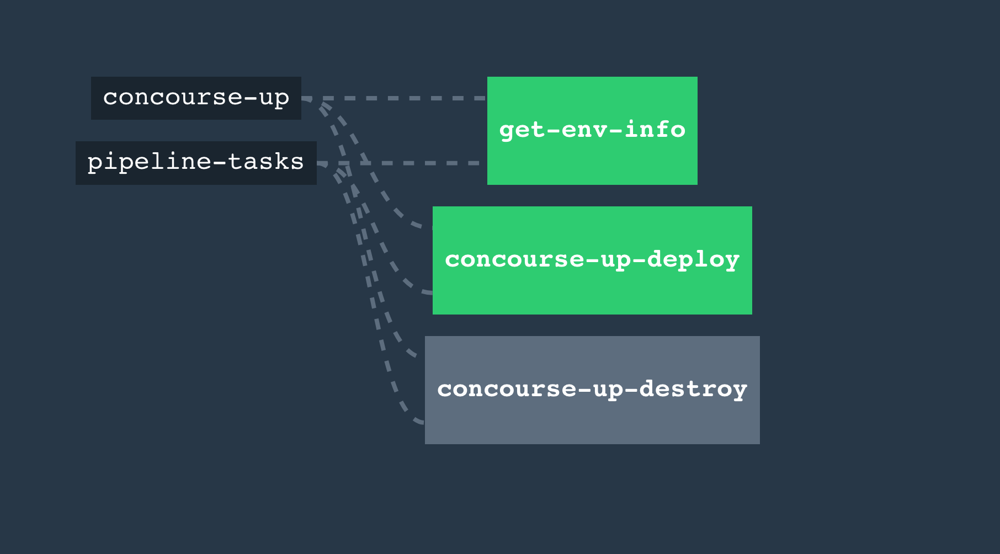

# concourse-up-up

A concourse-based encapsulation of [`concourse-up`](https://github.com/EngineerBetter/concourse-up) to run `concourse-up`... on concourse. You probably don't need this but it's a nice quick way to get a `ci.<some-org>.<tld>` up and running quick.

## concourse-local

Look inside `./set-pipelines.sh` for commands to set pipelines and launch a local instance of concourse.